# City Food Corner

An offline desktop cafe management system built with **Java, JavaFX and MySQL**. It handles staff access, inventory, sales, attendance and cash flow in one app, with no internet or special hardware needed.

## Features

- **Role-based access:** Administrator, Inventory Manager and Salesman each see only their own screens
- **Staff onboarding:** new staff sign up, the account stays *Pending* until the admin approves it and gives an employee ID (e.g. `CFCE-001`)
- **Inventory:** add, update, delete, search and import food items
- **Sales (POS):** build an order, enter customer info, take payment, calculate change and show a receipt
- **Auto stock control:** out-of-stock items are hidden from the sales menu
- **Shift tracking:** check-in on login, check-out on exit, working hours calculated automatically
- **Admin tools:** employee access control, read-only inventory view, sales history with analytics, cash-flow charts, salary payment and expense withdrawal

## Tech Stack

| Part | Technology |
|------|------------|
| Language | Java (JDK 17+) |
| GUI | JavaFX 21 (FXML + CSS) |
| Database | MySQL 8.0 |
| Pattern | MVC with DAO layer |
| Build tool | Apache Maven |
| Password hashing | SHA-256 |

## Project Structure

```
src/main/java/com/mr_rabbit/polishedcityfoodcorner/
├── controller/   # screen logic
├── dao/          # JDBC queries
├── db/           # database connection
├── model/        # Employee, Product, OrderItem, ...
└── util/         # SceneSwitcher, SessionManager, PasswordUtil, ...
src/main/resources/   # FXML, CSS, images, icons
GUI/                  # screenshots and diagrams
city_food_corner_schema.sql
```

## How to Run

1. Install JDK 17+ and MySQL 8.0
2. Clone the repo
   ```bash
   git clone https://github.com/opusutradhar52/FoodCorner.git
   cd FoodCorner
   ```
3. Create the database by running the SQL file
   ```bash
   mysql -u root -p < city_food_corner_schema.sql
   ```
4. Set your MySQL username and password in `db/DatabaseConnection.java`
5. Run the app
   ```bash
   mvn clean javafx:run
   ```

## Architecture

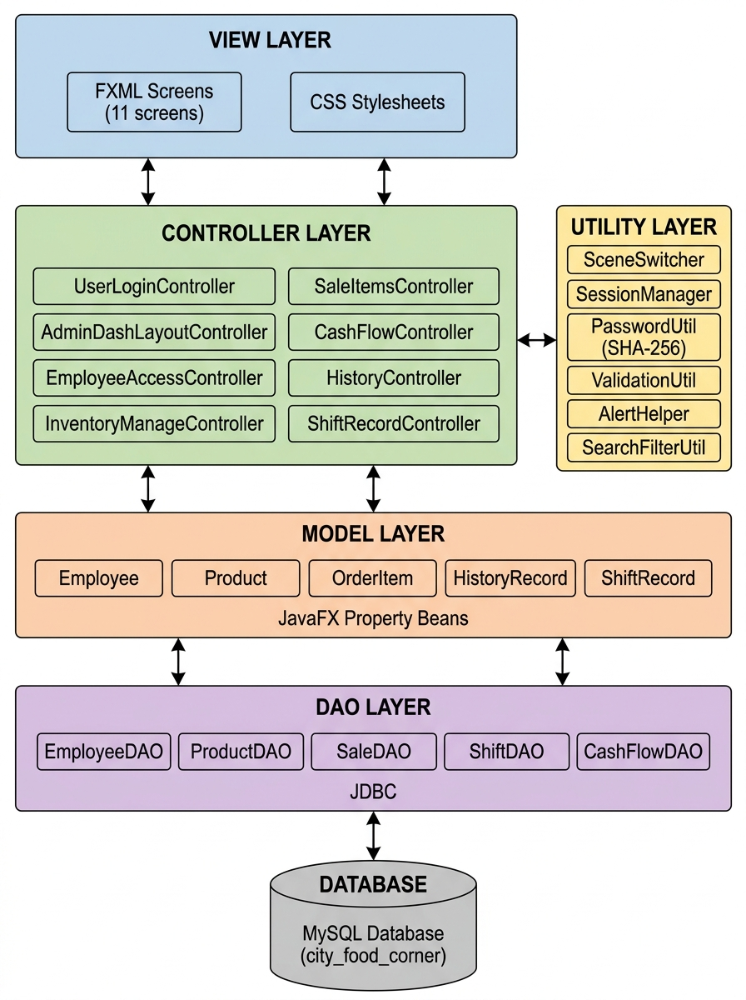

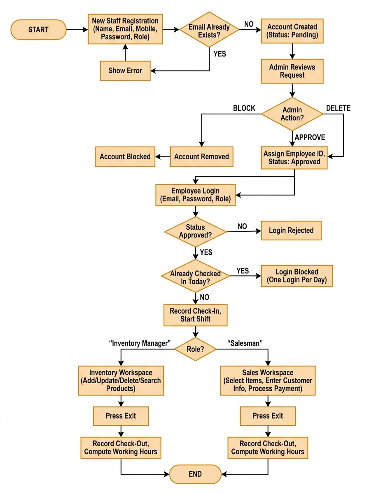

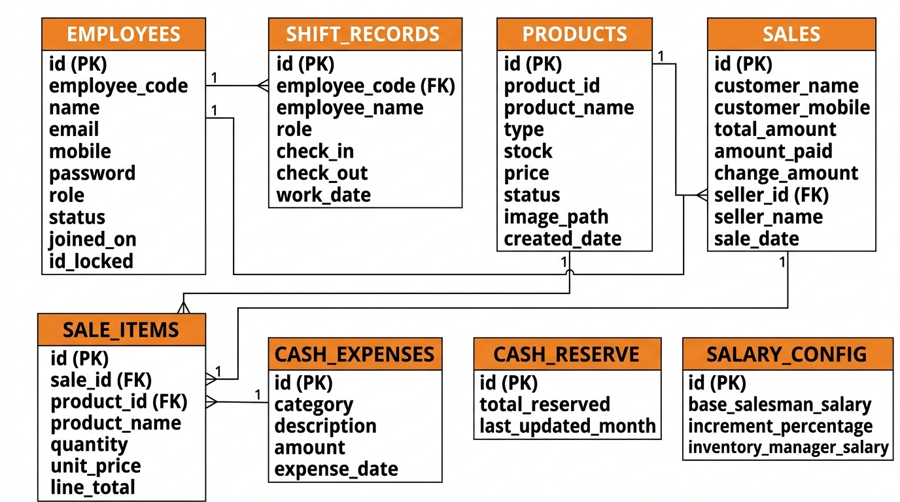

## Screenshots

| | |
|---|---|
| 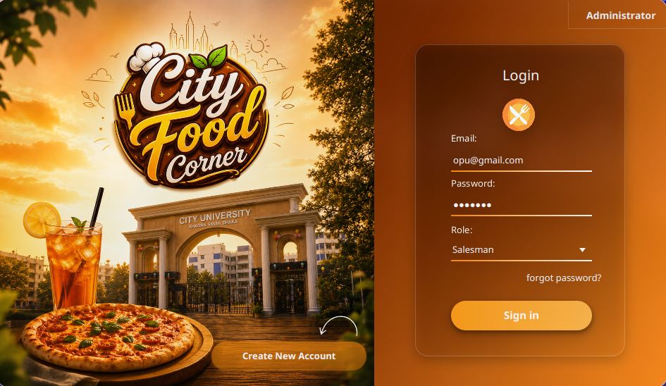 | 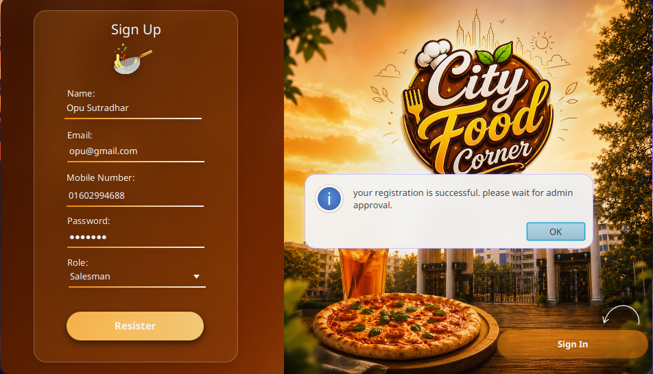 |
|  | 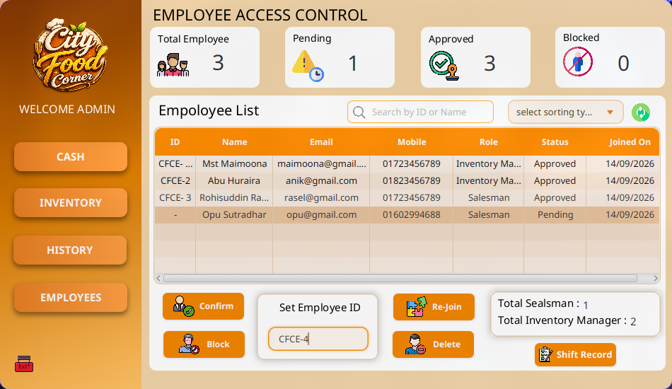 |
| 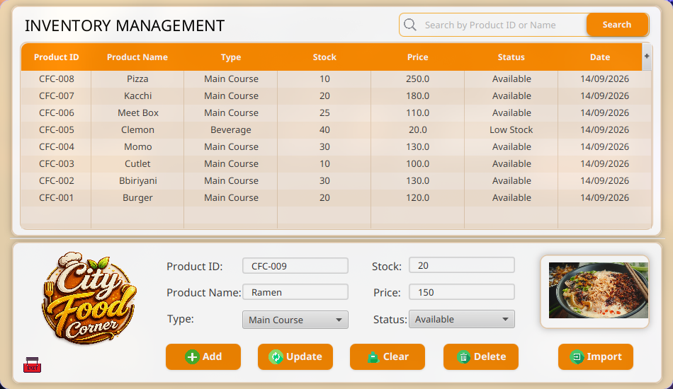 | 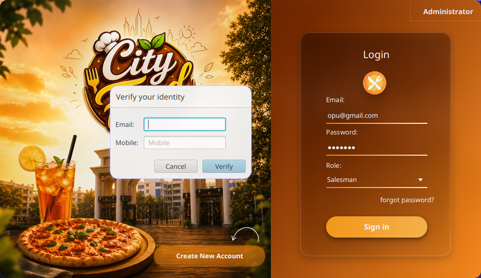 |
| 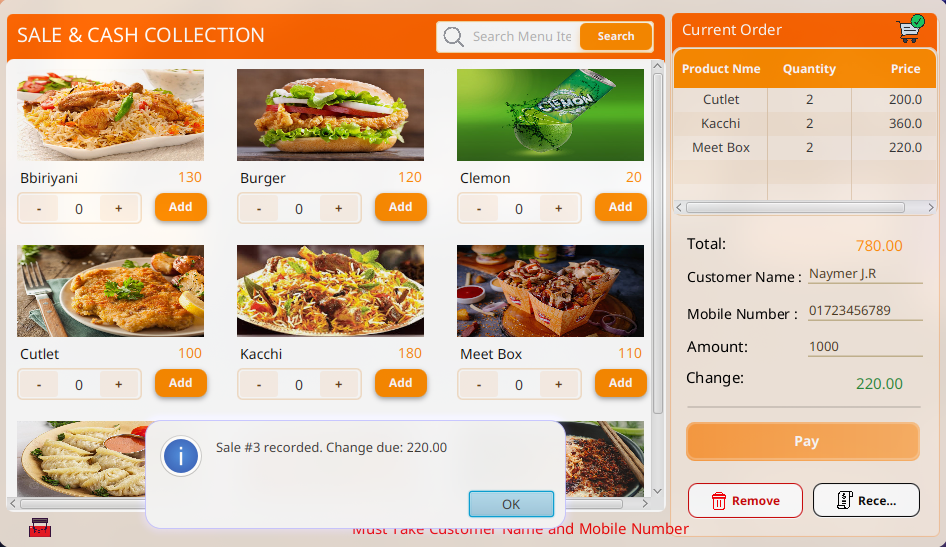 | 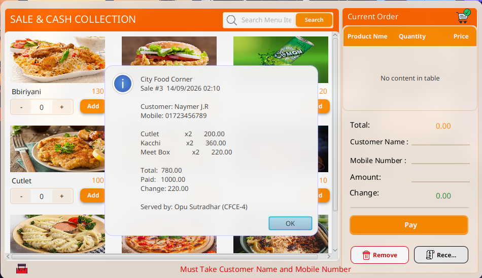 |
| 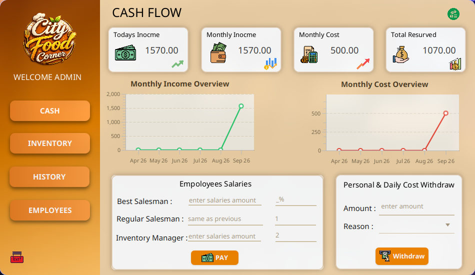 | 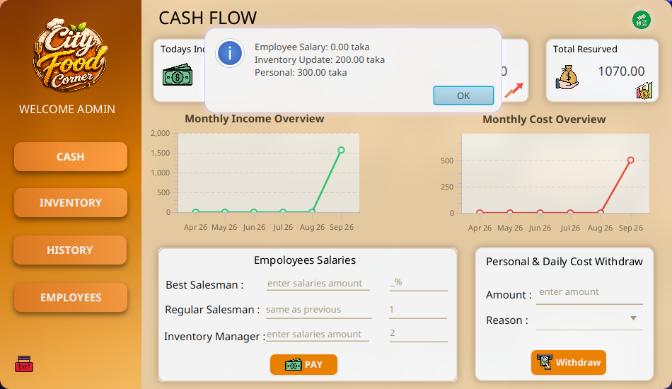 |
| 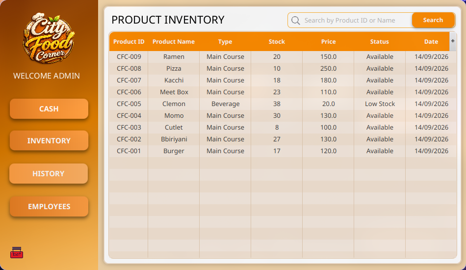 | 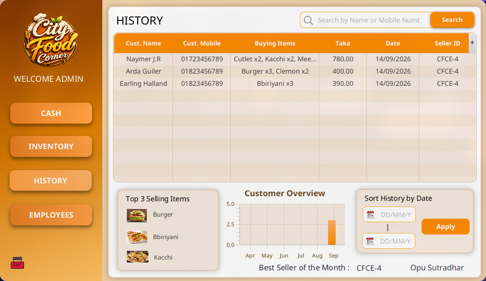 |
| 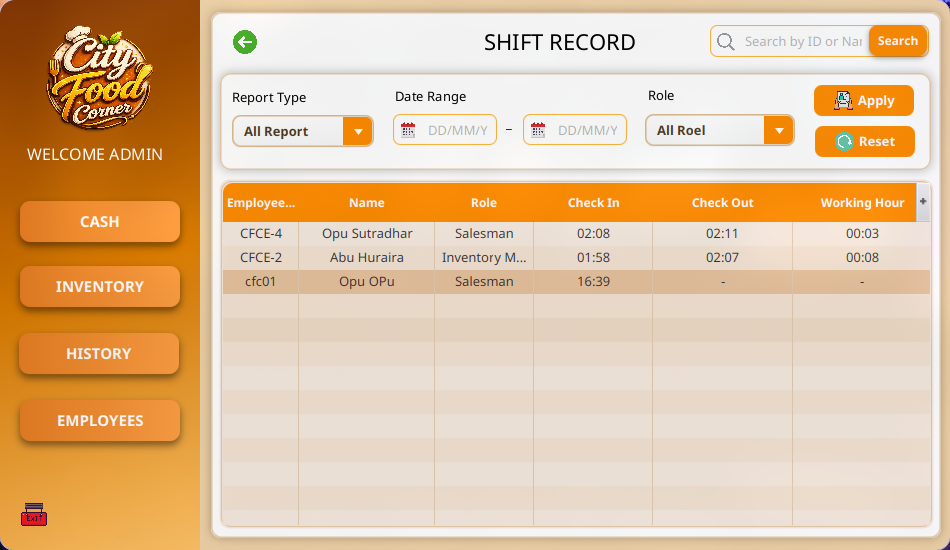 | |

## Limitations

- Runs on a single computer (local database)
- Cash payments only
- No email verification
- No automatic backup

## Future Work

- Cloud database for multi-device access
- OTP-based two-factor login
- bKash, Nagad and card payments
- Email verification at sign-up
- Scheduled database backup

## Team

Capstone Project (CSE 2200), Department of CSE, City University, Dhaka

- Opu Sutradhar
- Md. Roisuddin Rasel
- Abu Huraira Anik
- Mst. Maimoona

**Supervisor:** Mst. Shikha Moni
